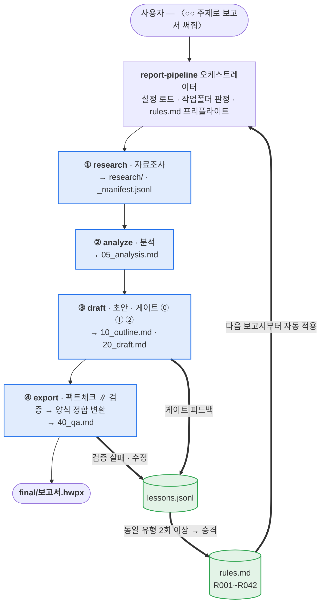
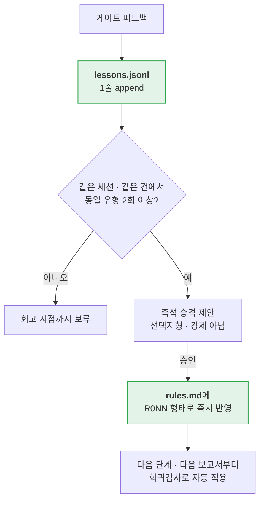

# report-harness

**"이 주제로 보고서 써줘" 한 마디로 기관보고서 hwpx 파일까지 만드는 Claude Code 플러그인.**

[](LICENSE)


```
/plugin marketplace add kca-deep/report-harness
/plugin install report-harness@report-harness
```

설치 후 아무 말이나 하면 된다 → `"AI 활용 성과측정 체계 개선방안으로 보고서 써줘"`

자세한 설치 절차는 [4. 설치 방법](#4-설치-방법-installation)에 있다.

---

## 목차

1. [개요](#1-개요) — 무엇을 위한 물건인가, 어떻게 생겼나
2. [주요 기능 및 내용](#2-주요-기능-및-내용) — 4단계·게이트·복리축적·양식 정합
3. [의존성 — MCP·스킬](#3-의존성--mcp스킬) — 번들 포함분과 별도 설치분
4. [설치 방법 (Installation)](#4-설치-방법-installation) — 처음부터 끝까지
5. [설정 (선택)](#5-설정-선택) — 설정 없이도 동작한다
6. [부록 — 개발자용](#부록--개발자용)

---

## 1. 개요

### 1-1. 무엇을 하는 물건인가

공공기관·공기업에서 쓰는 **개조식 기관보고서**를 자료조사부터 최종 `.hwpx` 파일까지 한 번에
만들어 주는 Claude Code 플러그인이다.

보통 보고서 한 건을 쓰려면 이런 일을 사람이 다 한다.

> 자료 찾아 읽기 → 쟁점 추리기 → 목차 잡기 → 개조식으로 옮겨 쓰기 → 한글 열어서
> 글머리 기호(□·ㅇ·-) 맞추고 → 폰트·크기·줄간격 맞추고 → 표 정렬하고 → 붙임 배너 달기

이 플러그인은 위 흐름을 **4단계 파이프라인**으로 만들어 두고, 사람은 **딱 3번만** 판단하면
되도록 줄인다. 나머지는 자동으로 흘러간다.

### 1-2. 이런 분들에게 쓸모 있다

| 상황 | 이 플러그인이 하는 일 |
|---|---|
| 자료가 하나도 없다 | ①조사부터 시작해 4단계 전 구간 |
| 참고자료 hwp·pdf 몇 건이 이미 있다 | ②분석부터 진입 (자료 파싱·적재 포함) |
| 분석은 끝났고 초안만 필요하다 | ③초안작성만 |
| 마크다운 초안이 있고 hwpx만 필요하다 | ④변환만 (양식 정합 후처리 포함) |

4단계를 전부 거칠 필요가 없다. **가진 재료에 맞는 단계로 바로 들어가면 된다.**

### 1-3. 무엇이 나오나 — 산출물

최종 산출물은 한글(HWP) 양식에 맞춘 `.hwpx` 파일이다. 단순히 "글자만 담긴 hwpx"가 아니라
**기관 양식 실측값**으로 맞춰서 나온다.

- 글머리 기호 계층(`□` → `ㅇ` → `-`)과 계층별 들여쓰기·내어쓰기
- 폰트·크기(본문/제목/발신 줄 12pt 등)·줄간격·문단 간격
- 표 정렬 및 **본문 폭 정합**(표가 본문 너비를 벗어나지 않게 맞춤)
- 각주 별표(`*`) 처리, 붙임 배너, 머리말 배너

### 1-4. 전체 구조도



**핵심은 오른쪽으로 돌아 올라가는 고리다.** 게이트에서 받은 지적이 `lessons.jsonl`에 쌓이고, 반복되면
`rules.md`에 규칙으로 승격되어 다음 보고서부터 자동 적용된다. **쓰면 쓸수록 같은 지적을
덜 받는다.**

### 1-5. 작업폴더 구조 — "폴더가 맥락을 기억한다"

건별로 작업폴더 하나가 만들어지고, 각 단계는 이 폴더를 인터페이스로 읽고 쓴다.

```
{reports_dir}/20260729/1430_AI성과측정체계/
├── 00_context.md              요구사항·게이트 답변 누적 (세션 맥락)
├── research/
│   ├── provided/              내가 준 자료 원본 + kordoc 파싱본(.md)
│   └── fetched/{topic}/       조사 단위 1개 = 폴더 1개 (슬러그는 한글 가능)
│       ├── _manifest.jsonl    산출물 1건당 1줄 (출처·시각·도구·확정/추정)
│       ├── {source}.md        프론트매터로 원출처 명시, 원문 발췌
│       └── images/            이미지 후보 원본
├── 05_analysis.md             논지 후보 · 총괄표 후보 · 근거 공백 목록
├── 10_outline.md              목차·논지·근거·표 설계·도식 설계
├── 20_draft.md                개조식 초안 (SSOT — 이 파일이 진실의 원본)
├── 35_factcheck.md            팩트체크 결과 (전수 선택 시)
├── 40_qa.md                   검증 리포트
└── final/
    └── {title}.hwpx           ★ 최종 산출물
```

세션이 끊겨도 `"이어서 해줘"` 한 마디면 이 폴더 상태를 읽고 그 지점부터 재개한다.
**새 폴더를 만들지 않는다** — 세션 기억이 아니라 폴더가 맥락을 기억하기 때문이다.

### 1-6. 저장소 구조

```
report-harness/
├── .claude-plugin/
│   ├── plugin.json          플러그인 정의 (이름·버전·라이선스)
│   └── marketplace.json     이 저장소 자체를 마켓플레이스로 등록
├── .mcp.json                ★ 번들 MCP 2종 정의 (kordoc·korean-law)
│
├── skills/
│   ├── report-pipeline/     ★ 오케스트레이터 — 4단계 전체를 지휘
│   │   ├── SKILL.md         단계 흐름·게이트·시간예산 정의
│   │   ├── references/      ← 판단 기준 (LLM이 읽는 문서)
│   │   │   ├── style-guide.md             실보고서 34건에서 뽑은 문체·구성 관례
│   │   │   ├── md-profile.md              변환 가능한 마크다운 규격 + 린트 룰 8종
│   │   │   ├── format-profile.kca.md      기관 양식 실측 프로파일(폰트·크기·여백)
│   │   │   ├── hwpx-recipe.md             hwpx 변환 절차서
│   │   │   ├── rules-seed.md              회귀 방지 규칙 R001~R042 (복리축적 시드)
│   │   │   ├── diagram-pool.md            표 기반 도식 패턴 카탈로그
│   │   │   └── table-pool.md              표 부품 카탈로그
│   │   ├── scripts/         ← 결정론 도구 (기계가 실행, LLM 판단 배제)
│   │   │   ├── harness_config.py          설정 해석·기본값 폴백
│   │   │   ├── lint_md_profile.py         초안 규격 검사 (룰 8종)
│   │   │   ├── prep_report_md.py          변환 전 정규화 (무손실 보장)
│   │   │   ├── postprocess_hwpx.py        ★ 양식 정합 후처리 (R011~R042)
│   │   │   ├── validate_hwpx.py           구조·대조·수치 검증
│   │   │   ├── check_image_size.py        이미지 규격 판정
│   │   │   └── extract_format_profile.py  양식 파일에서 프로파일 추출
│   │   └── assets/          기관 양식 원본·도식 Pool·머리말 배너 자산
│   │
│   ├── report-research/     ① 자료조사 — 방법은 자유, 산출 계약만 강제
│   │   ├── SKILL.md
│   │   └── references/      ← tool-playbook.md (어떤 도구를 언제 쓰나)
│   │
│   └── humanizer/           초안 윤문 — AI 문체 흔적 제거 (MIT © DaleSeo)
│
├── commands/                슬래시 커맨드 4종 (단계별 진입점)
├── scripts/                 배포 가드 (package_check.sh · pii_scan.py)
└── tests/                   pytest 9종 (참조 정합성·후처리 회귀 등)
```

### 1-7. 설계 원칙 셋

**① 판단은 문서로, 실행은 스크립트로.**
`references/`는 LLM이 읽고 판단하는 기준이고, `scripts/`는 판단이 끼어들면 안 되는 결정론
작업(정규화·린트·검증·후처리)이다. 양식 정합처럼 "매번 똑같아야 하는 것"은 전부 스크립트로
내려서 LLM 편차를 없앴다.

**② 조사는 방법을 강제하지 않는다.**
`report-research`가 요구하는 건 오직 산출 계약(`research/` 경로 규약 + `_manifest.jsonl`
스키마)뿐이다. 환경에 있는 도구를 골라 쓰고, 없는 도구는 건너뛰고 대체 경로로 흡수한다.
그래서 **도구가 하나도 없어도 파이프라인이 멈추지 않는다.**

**③ 규칙은 복리로 쌓인다.**
게이트에서 받은 지적이 `lessons.jsonl`에 기록되고, 반복되거나 사용자가 확정하면 `rules.md`에
`R0NN`으로 승격된다. 다음 보고서부터 그 규칙이 회귀검사로 자동 적용된다. 현재
**R001~R042**가 시드로 들어 있다.

---

## 2. 주요 기능 및 내용

### 2-1. 4단계 파이프라인

| 단계 | 하는 일 | 입력 | 산출물 | 시간 상한 |
|---|---|---|---|---|
| **① research** | 자료조사 — 제공자료 적재·신규조사·vault 사전지식 조회 | 주제 또는 제공 파일 | `research/` + `_manifest.jsonl` | — |
| **② analyze** | 조사 결과 종합 분석 | `research/` 전체 | `05_analysis.md` | 5분 |
| **③ draft** | 개조식 초안 작성 (게이트 3개 전부 여기) | `05_analysis.md` | `10_outline.md` → `20_draft.md` | 10분 |
| **④ export** | 팩트체크 ∥ 회귀검사 → 양식 정합 변환 | 승인된 `20_draft.md` | `final/{제목}.hwpx` + `40_qa.md` | 5분 |

시간 상한은 **기계 시간**(게이트 대기 제외) 기준이며, 초과가 임박하면 조사 팬아웃 축소 →
분석 팬아웃 축소 → 감사 1패스화 → 팩트체크 경량 강등 순으로 자동 축소한다.
전 구간 30분을 넘기면 설계 실패로 간주하고 소요 구간을 `lessons.jsonl`에 남긴다.

### 2-2. 사람이 개입하는 지점 — 게이트 3회뿐

모든 개입은 **선택지 클릭형**이다. "어떻게 할까요?" 같은 열린 질문을 던지지 않는다.

| 게이트 | 시점 | 묻는 것 |
|---|---|---|
| **게이트⓪** | ③draft 시작 | 보고서 유형(계획/검토/결과/동향) · 수신자 격·분량 · 핵심 논지 방향 · 맺음말 계열 (최대 4문항, `05_analysis.md`로 답이 명확한 건 건너뜀) |
| **게이트①** | 아웃라인 완성 | 아웃라인 승인 / 수정 지정 / 방향 전환. 논지 구조가 갈리면 **2안을 병렬 생성**해 선택지로 제시 |
| **게이트②** | 초안 완성 | 초안 승인 + **팩트체크 범위**(전수/경량/생략) 선택. 수정은 절 주소 ID로 한 줄 지시 — `"□3 ㅇ2 수치 중심으로"` |

그 외에는 질문하지 않는다. 애매하면 기본값으로 진행하고 인도 시 1줄로만 고지한다.

### 2-3. 자료조사 — 산출 계약 중심

조사 **방법**은 자유다. 강제되는 건 산출물이 계약대로 쌓이는 것뿐이다.

- **3가지 모드**: 제공자료 적재(I) · vault 사전지식 조회(Q, 설정 시) · 신규조사(R)
- **소스 우선순위**: 제공자료 → 사전지식 → 신규조사 (이미 확보된 근거를 다시 조사하지 않음)
- **팩트/주장 분리**: 조사 산출물은 **원문 발췌**로 수집한다. 의역·자체 요약으로 대체하지
  않으며, 판단·평가는 이 단계에서 섞지 않는다.
- **확정/추정 태깅**: `확정`(원출처를 직접 열어 대조 가능) / `추정`(2차 인용·간접 언급)
  둘 중 하나로만 태깅한다.
- **병렬 팬아웃**: 조사 주제를 상호 독립 단위로 분해해 동시 조사한다.

### 2-4. 초안작성 — 일관성 우선

- **메인 단일 컨텍스트에서 집필**한다. 절별 병렬 집필은 하네스 전체의 금기 2건 중 하나다
  (문체·논지가 갈리기 때문).
- **결정론 lint (shift-left)**: `lint_md_profile.py`로 변환 가능 규격을 먼저 검사한다.
  위반이 있으면 통과할 때까지 자동 수정하며, **사용자에게 보이지 않는다.**
- **스타일 감사 ∥ humanizer 병렬**: 독립 에이전트가 `style-guide.md`로 감사하고, 동시에
  서술형 구간에만 humanizer를 적용해 AI 문체 흔적을 지운다(개조식 명사형 종결부는 제외).
  적용 전후 **diff로 수치·인용 불변을 검증**하고, 불일치 시 해당 절만 롤백 후 재적용한다.

### 2-5. hwpx 변환 — 양식 정합 후처리가 핵심

kordoc이 생성한 hwpx는 **아직 양식 정합이 아니다.** 그래서 변환 절차에 후처리 단계가 박혀 있다.

```
prep 정규화 → kordoc generate_document → 이미지 규격판정·주입
   → ★ postprocess_hwpx.py --all --sender-size 12  ← 이걸 건너뛰면 규칙 위반본이 나온다
   → validate_hwpx.py structural → 왕복 되읽기 → validate_hwpx.py compare
```

후처리 스크립트가 hwpx XML을 직접 고쳐 적용하는 규칙:

| 플래그 | 적용 규칙 |
|---|---|
| `--star-footnote` | R011 (각주 별표 처리) |
| `--spacing` | R013~R015 · R017 · R019 · R020 · R022~R025 · R027 · R031~R035 · R037~R040 (계층 간격·정렬·폰트·캡션) |
| `--header-banner` | R030 · R041 (머리말 배너) |
| `--sender-size 12` | R018 (발신 줄 12pt) — **`--all`에 포함되지 않아 별도 지정 필요** |
| (플래그 무관 상시) | R036 · R042 (표 폭 본문 정합) |

왕복 대조에서 불일치가 나오면 최대 2회까지 재변환하고, 그래도 남으면 목록을 명시 보고한 뒤
`20_draft.md`(SSOT)를 그대로 인도한다 — **틀린 hwpx를 조용히 내주지 않는다.**

### 2-6. 복리 축적 — 쓸수록 좋아진다



`rules.md`의 각 항목에는 단계 태그(`[research]`/`[analyze]`/`[draft]`/`[export]`)가 붙고,
각 단계는 **자기 태그 항목만** 프리플라이트에 반영한다. 첫 실행 시 `rules-seed.md`
(R001~R042)가 `state_dir`로 복사되어 시드가 된다.

### 2-7. 사용법 두 가지

**자연어로 (권장)**

| 이렇게 말하면 | 이렇게 동작한다 |
|---|---|
| `"○○ 관련 최신 동향 조사해서 보고서 만들어줘"` | ①②③④ 전 구간 |
| `"이어서 해줘"` | 마지막 작업폴더를 찾아 그 지점부터 재개 |
| `"hwpx로 변환해줘"` | 승인된 초안이 있으면 ④단계만 |
| `"이 자료들 참고해서 초안 만들어줘"` + 파일 첨부 | ②③단계 |

**슬래시 커맨드로 (단계 단위 직접 진입)**

| 커맨드 | 단계 | 언제 쓰나 |
|---|---|---|
| `/report-research [주제]` | ① | 조사부터 시작 |
| `/report-analyze [건명]` | ② | 자료가 이미 있을 때 |
| `/report-draft [건명]` | ③ | 분석까지 끝났을 때 |
| `/report-export` | ④ | 초안만 hwpx로 바꿀 때 |

---

## 3. 의존성 — MCP·스킬

### 3-1. 한눈에 보기

| 구분 | 이름 | 필수 여부 | 설치 |
|---|---|---|---|
| 스킬 | `report-pipeline` | 필수 | ✅ **번들 포함** — 할 일 없음 |
| 스킬 | `report-research` | 필수 | ✅ **번들 포함** — 할 일 없음 |
| 스킬 | `humanizer` | 선택 | ✅ **번들 포함** — 할 일 없음 |
| MCP | `kordoc` | **필수** | ✅ **번들 포함** — 첫 실행 시 npx 자동 설치 |
| MCP | `korean-law` | 선택 | ✅ **번들 포함** — 단, **API 키 직접 발급 필요** |
| 플러그인 | `insane-search` | 선택 | ⬜ 별도 마켓플레이스에서 설치 |
| 외부 | 개인 지식 vault | 선택 | ⬜ 설정 파일에 경로만 지정 |

### 3-2. 번들 포함분 — 따로 설치할 게 없다

플러그인을 설치하면 아래가 **한꺼번에** 붙는다. 개별 설치 명령이 필요 없다.

#### 스킬 3종 (`skills/`)

| 스킬 | 역할 | 출처 |
|---|---|---|
| `report-pipeline` | 4단계 오케스트레이터. references 7종 + scripts 7종 + assets 포함 | 이 저장소 |
| `report-research` | 자료조사 (산출 계약 강제). tool-playbook 포함 | 이 저장소 |
| `humanizer` | 한국어 AI 문체 흔적 제거 (40개 패턴, KatFishNet 논문 기반) | MIT © [DaleSeo](https://github.com/DaleSeo) — 원본 라이선스 고지를 `skills/humanizer/LICENSE`로 유지 |

#### MCP 서버 2종 (`.mcp.json`)

플러그인의 `.mcp.json`에 정의되어 있어 설치 시 자동 등록된다. 서버 실행은 `npx -y`로 이뤄지며,
**첫 실행 때 패키지를 내려받으므로 네트워크 연결이 필요하다.**

```jsonc
{
  "mcpServers": {
    "kordoc":     { "command": "npx", "args": ["-y", "kordoc", "mcp"] },
    "korean-law": { "command": "npx", "args": ["-y", "korean-law-mcp"],
                    "env": { "LAW_OC": "${LAW_OC}" } }
  }
}
```

| MCP | 필수 | 역할 | API 키 |
|---|---|---|---|
| **`kordoc`** | **필수** | hwp·hwpx·pdf·docx 파싱, hwpx 생성·검증·패치 | **불필요** |
| `korean-law` | 선택 | 법령·판례·행정규칙 근거 조사 | **필요** (아래 3-3) |

> **kordoc이 없으면?** 마크다운 초안(`20_draft.md`)까지만 만들어지고, hwpx 변환이 불가능하다는
> 사실을 1줄로 알려준다. 파이프라인이 침묵하며 실패하지 않는다.

### 3-3. `korean-law` API 키 발급 — 무료, 1분

법령 조사 기능을 쓰려면 **법제처 Open API 인증키(OC)** 가 필요하다.

1. 법제처 Open API 신청 페이지 접속 → **https://open.law.go.kr/LSO/openApi/guideList.do**
2. 회원가입 → 로그인 → **"Open API 사용 신청"** 클릭
3. 발급받은 **인증키(OC)** 를 환경변수로 등록

```bash
# ~/.zshrc (zsh) 또는 ~/.bashrc (bash)에 추가
export LAW_OC="발급받은_인증키"
```

```bash
# 적용 후 확인
source ~/.zshrc && echo $LAW_OC
```

> **키가 없어도 나머지는 전부 정상 동작한다.** `korean-law` 서버만 연결에 실패하고,
> 법령 조사가 필요한 대목은 일반 웹 검색으로 대체된다.

### 3-4. 별도 설치 — 있으면 좋은 것 (없어도 무방)

#### `insane-search` — 봇 차단 사이트 조사용

X/Twitter·Reddit·네이버·유튜브처럼 WAF·봇 차단이 걸린 사이트에서 자료를 가져올 때 쓴다.
없으면 접근 가능한 소스만 조사한다(파이프라인은 정상 동작).

```
/plugin marketplace add fivetaku/gptaku_plugins
/plugin install insane-search@gptaku-plugins
```

저장소: **https://github.com/fivetaku/gptaku_plugins**

#### 개인 지식 vault (Obsidian 등)

`knowledge_vault` 경로를 설정하면 조사 결과를 vault에 축적하고, 다음 보고서에서 사전지식으로
재활용한다(모드 Q). 설정하지 않으면 vault 기능만 존재하지 않는 것처럼 생략된다.
설치할 것은 없고 [5. 설정](#5-설정-선택)에서 경로만 지정하면 된다.

---

## 4. 설치 방법 (Installation)

### 4-0. 사전 요구사항

| 항목 | 최소 버전 | 확인 명령 | 용도 |
|---|---|---|---|
| **Claude Code** | 플러그인 지원 버전 | `claude --version` | 본체 |
| **Node.js / npx** | Node 18+ | `node -v && npx -v` | MCP 서버 실행 (`kordoc`·`korean-law`) |
| **Python 3** | 3.9+ | `python3 --version` | 결정론 스크립트 실행 (**stdlib만 사용 — pip 설치 불필요**) |
| 네트워크 | — | — | 첫 실행 시 npx 패키지 다운로드 |

Python 패키지 의존성은 **없다.** `harness_config`·`lint_md_profile`·`postprocess_hwpx` 등
모든 스크립트가 표준 라이브러리(`json`·`pathlib`·`zipfile`·`xml.etree`)만 쓴다.

### 4-1. 설치 (2줄)

Claude Code를 실행한 뒤 프롬프트에 순서대로 입력한다.

```
/plugin marketplace add kca-deep/report-harness
```

이 저장소는 **플러그인이면서 동시에 마켓플레이스**다(`.claude-plugin/marketplace.json`).
위 명령으로 저장소를 마켓플레이스로 등록한다.

```
/plugin install report-harness@report-harness
```

`{플러그인명}@{마켓플레이스명}` 형식이며, 둘 다 `report-harness`라서 이렇게 쓴다.

> 설치 대신 `/plugin` 메뉴에서 GUI로 골라 설치해도 된다.

### 4-2. 설치 확인

**① 스킬·커맨드 등록 확인**

```
/report-
```

까지 입력했을 때 `report-research` · `report-analyze` · `report-draft` · `report-export`
4종이 자동완성에 뜨면 커맨드가 붙은 것이다.

**② MCP 서버 연결 확인**

```
/mcp
```

`kordoc`이 **connected**로 뜨면 정상이다. `korean-law`는 `LAW_OC` 환경변수를 등록하지 않았다면
연결 실패로 표시되는 것이 정상이며, 나머지 기능에 영향을 주지 않는다.

> 첫 `/mcp` 확인 시 `kordoc`이 연결 중이거나 실패로 보일 수 있다. npx가 패키지를 내려받는
> 중이기 때문이다. 잠시 후 다시 확인하거나 Claude Code를 재시작한다.

### 4-3. (선택) `korean-law` 키 등록

법령 조사가 필요하면 [3-3](#3-3-korean-law-api-키-발급--무료-1분) 절차로 `LAW_OC`를 등록한 뒤
**Claude Code를 재시작**한다. 환경변수는 프로세스 시작 시점에 읽히기 때문이다.

### 4-4. (선택) `insane-search` 설치

```
/plugin marketplace add fivetaku/gptaku_plugins
/plugin install insane-search@gptaku-plugins
```

### 4-5. 첫 실행

**설정 파일을 만들지 않아도 된다.** 전부 기본값으로 동작한다. 그냥 말을 걸면 된다.

```
"AI 활용 성과측정 체계 개선방안으로 보고서 써줘"
```

첫 실행 시 다음이 자동으로 준비된다.

1. `{cwd}/reports/{YYYYMMDD}/{HHMM}_{슬러그}/` 작업폴더 생성
2. `{cwd}/.report-harness/` 상태 폴더 생성
3. `rules-seed.md`(R001~R042)가 `.report-harness/rules.md`로 복사되어 복리축적 시드가 됨

경로를 바꾸고 싶으면 [5. 설정](#5-설정-선택)을 보면 된다.

### 4-6. 문제 해결

| 증상 | 원인 | 해결 |
|---|---|---|
| `/report-*` 커맨드가 안 뜬다 | 플러그인 미설치 또는 재시작 필요 | `/plugin` 메뉴에서 설치 상태 확인 후 Claude Code 재시작 |
| `/mcp`에서 `kordoc` 연결 실패 | npx 다운로드 실패 / 네트워크 | `npx -y kordoc mcp` 를 터미널에서 직접 실행해 오류 확인 |
| hwpx가 안 만들어지고 md만 나온다 | `kordoc` 미연결 | 위와 동일. 연결 복구 후 `"hwpx로 변환해줘"`로 ④단계만 재실행 |
| 법령 조사가 안 된다 | `LAW_OC` 미등록 | [3-3](#3-3-korean-law-api-키-발급--무료-1분) 참조 후 재시작 |
| 산출물이 어디 있는지 모르겠다 | 기본값이 실행위치 기준 | `{현재 작업 디렉토리}/reports/` 확인. 고정하려면 [5. 설정](#5-설정-선택) |
| hwpx 서식이 양식과 다르다 | 후처리 누락 가능성 | `40_qa.md` 확인. `postprocess_hwpx.py`가 exit 1(대상 0건)이면 원인 규명 필요 |
| `"이어서 해줘"` 했더니 새 폴더가 생겼다 | 슬러그 부분일치 실패 | 건명을 함께 말한다 — `"AI성과측정 건 이어서 해줘"` |

### 4-7. 제거

```
/plugin uninstall report-harness@report-harness
```

작업폴더(`reports/`)와 상태 폴더(`.report-harness/`)는 **삭제되지 않는다** — 축적된
`rules.md`·`lessons.jsonl`이 남으므로 재설치하면 복리 자산을 그대로 이어 쓴다.

---

## 5. 설정 (선택)

**설정 파일이 없어도 전 기능이 동작한다.** 첫 인도 시 안내를 1줄만 출력한다.
경로를 고정하고 싶으면 `~/.claude/report-harness.json`에 아래 4키만 채운다.

```json
{
  "reports_dir":     "/path/to/reports",
  "state_dir":       "/path/to/state",
  "knowledge_vault": "/path/to/obsidian-vault",
  "template_hwpx":   "/path/to/기관보고양식.hwpx"
}
```

| 키 | 없을 때 기본값 | 역할 |
|---|---|---|
| `reports_dir` | `{cwd}/reports` | 건별 작업폴더 루트(`{reports_dir}/{YYYYMMDD}/{HHMM}_{슬러그}/`) |
| `state_dir` | `{cwd}/.report-harness` (자동 생성) | `rules.md`·`lessons.jsonl` 위치. 첫 실행 시 `rules-seed.md`(R001~R042)를 복사 |
| `knowledge_vault` | 없음 → vault 기능(사전지식 조회·적재) 생략 | 개인 지식 vault 루트 |
| `template_hwpx` | 없음 → 번들 기본 서식 사용 | 기관 레터헤드·스타일 템플릿 병합용 |

> 기본값이 홈이 아니라 **실행위치(cwd) 기준**인 이유: 웹앱처럼 홈 디렉토리가 휘발성인 환경에서도
> 산출물과 복리 state가 프로젝트 폴더와 함께 남도록 하기 위해서다. 로컬 사용자는 설정 파일로
> 절대경로를 주입해 오버라이드하면 된다.

`template_hwpx`는 대개 비워 둔다 — KCA 기본 양식 프로파일이
`references/format-profile.kca.md`로 번들 시드되어 별도 지정 없이 적용된다.

**vault 연동 예시** — 조사 산출물 저장소와 사전지식 소스를 같은 vault로 묶는 구성:

```json
{
  "reports_dir": "~/workspace/my-vault/reports",
  "state_dir": "~/workspace/my-vault/reports/_harness",
  "knowledge_vault": "~/workspace/my-vault"
}
```

경로에 `~`를 쓸 수 있다(자동 확장된다).

---

## 부록 — 개발자용

### 로컬에서 직접 검증

플러그인 설치 없이 스킬·커맨드를 바로 시험하려면 복사한다.

```bash
cp -R skills/* ~/.claude/skills/
cp -R commands ~/.claude/
```

동일 이름 스킬이 이미 있으면(예: 다른 출처의 `humanizer`) 덮어쓰지 말고 파일 단위로 병합할 것.

### 배포 제외 항목

다음은 `.gitignore`로 배포 저장소에서 제외한다(로컬 파일은 유지, 추적에서만 제외).

- `form/` — 실보고서·기관 양식 원본(hwp/hwpx) 12.6MB. 코퍼스 분석·실측 재검증용 로컬
  원자재이며 민감할 수 있어 배포하지 않는다. **런타임은 이 경로를 참조하지 않는다**(참조 0곳).
- `docs/analysis/` — 위 코퍼스에 대한 내부 분석 산출물.

런타임이 읽는 양식 자산은 `skills/report-pipeline/assets/` 아래 번들 사본이다
(`harness_config`의 `assets_dir`, 스킬 상대 경로 고정 — 배포 환경에서 `form/` 부재를 전제).

- `250609_표준보고서_KCA_문서양식.hwp` (64KB) — 양식 원본과 바이트 동일(md5 `88378b94…`)
- `도식Pool-경량.hwpx` (103KB) — 도식 Pool 원본(8.9MB)의 이미지 제거 경량본, 표 90개 유효

프레임워크·표 모음 원본은 번들 사본이 없으나, 추출 결과가 `table-pool.md`·`diagram-pool.md`에
성문화돼 있어 런타임에는 원본이 필요 없다.

### 패키징 가드 (배포 전 필수)

```bash
bash scripts/package_check.sh
```

- `git ls-files`로 `form/`·`docs/analysis/`가 여전히 추적 중인지 확인(추적 중이면 즉시 실패).
- `scripts/pii_scan.py`로 `skills/`·`commands/`만 스캔해 전화번호·이메일 잔존을 검사한다
  (`tests/` 픽스처는 의도적 PII 예시를 포함하므로 스캔 대상에서 제외).
- 모두 통과하면 `package check OK`를 출력한다.

### 테스트

```bash
python3 -m pytest -q
```

참조 문서 간 정합성(`test_references_consistency.py`), 플러그인·마켓플레이스 매니페스트 구조와
버전 일치(`test_plugin_structure.py`), 후처리 규칙 회귀(`test_postprocess_hwpx.py`)를 포함한다.

---

## 라이선스

MIT © 2026 bcchung81 — 전문은 [LICENSE](LICENSE).

번들된 `skills/humanizer/`는 MIT © [DaleSeo](https://github.com/DaleSeo)의 별도 저작물이며
원본 라이선스 고지를 `skills/humanizer/LICENSE`로 유지한다.
